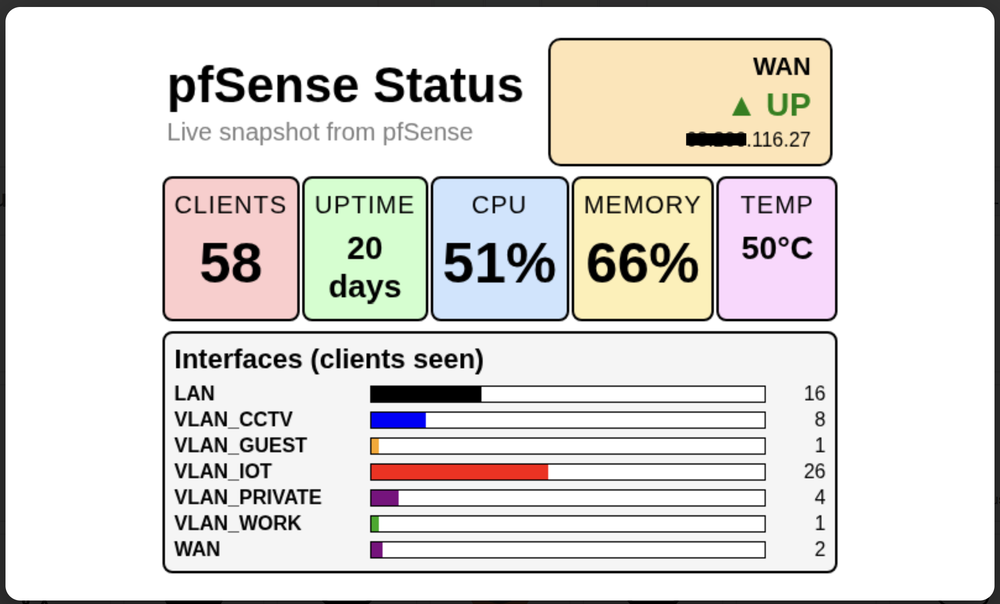
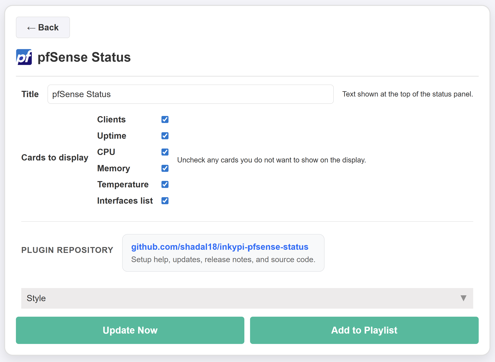

# pfSense Status

An InkyPi plugin that displays key pfSense status information on your e-paper dashboard.

_pfSense Status_ is a plugin for [InkyPi](https://github.com/fatihak/InkyPi) that exposes core pfSense firewall and network stats on your InkyPi frame.

## Install

Use the InkyPi plugin installer with the plugin ID and this repository URL, following the install pattern shown by the official InkyPi plugin template.

```bash
inkypi plugin install pfsense_status https://github.com/shadal18/inkypi-pfsense-status
```

## Update

To update the plugin on your InkyPi device:

1. SSH into your InkyPi host.
2. Change into the plugin directory:
   ```bash
   cd ~/InkyPi/src/plugins/pfsense_status
   ```
3. Run this update command:
   ```bash
   git pull origin main && \
   if [ -d pfsense_status ]; then \
     rsync -a pfsense_status/ ./ && \
     rm -rf pfsense_status; \
   fi && \
   sudo systemctl restart inkypi.service
   ```

If you do not see changes after updating:

- Confirm you are in the correct plugin folder.
- Clear your browser cache or hard refresh the InkyPi web UI.
- Check the InkyPi logs for any plugin errors.

## Requirements

- A working InkyPi installation with plugin support.
- A reachable pfSense instance with the REST API enabled and accessible.
- A valid pfSense REST API key with permission to access status and diagnostics endpoints.
- Network access from the InkyPi device to the pfSense host.
- HTTPS access configured correctly if your pfSense API is exposed over SSL.

## Features

This plugin is an extension for the InkyPi e-paper display frame and includes the following features.

- Shows active client count based on the pfSense ARP table.
- Shows system uptime.
- Shows CPU usage.
- Shows memory usage.
- Shows system temperature when available from the pfSense API.
- Shows WAN status and WAN IP information.
- Shows interface client distribution summary based on ARP table activity.
- Configurable title text.
- Optional display of clients card.
- Optional display of uptime card.
- Optional display of CPU card.
- Optional display of memory card.
- Optional display of temperature card.
- Optional display of interfaces list.
- Clean layout optimized for quick glance reading on e-paper.

## pfSense API key setup

This plugin requires a pfSense REST API key, and the key can be created from the pfSense web interface under **System > REST API > Keys** .

To add the key in InkyPi:

1. Open the InkyPi front page.
2. Click the **key icon**.
3. Add a new key named `PFSENSE_API_KEY`.
4. Paste in your pfSense API key.
5. Save it.
6. Restart InkyPi if needed.

## Settings

The plugin settings page lets you customize:

- Title text
- Which cards are displayed
- Optional display sections depending on your layout

## Repository

GitHub repository:

[https://github.com/shadal18/inkypi-pfsense-status](https://github.com/shadal18/inkypi-pfsense-status)

## Screenshots

- Main plugin display showing active spools.
- Plugin settings screen.

<p align="center">
  
  
</p>
